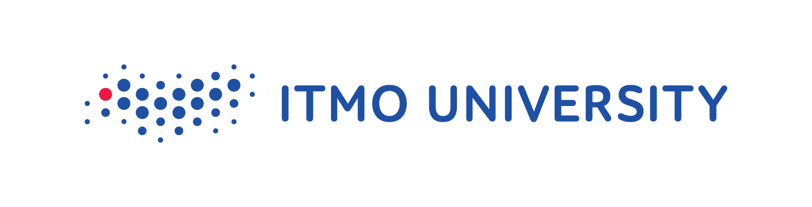

    

    
  
  
  

# AI Talent Hub: BootCamp 2023
# Recommendation system for individual career roadmap
###### 5random team

## Contents
- [AI Talent Hub: BootCamp 2023](#ai-talent-hub-bootcamp-2023)
  - [Contents](#contents)
  - [Problem](#problem)
  - [Description](#description)
  - [Architecture](#architecture)
  - [Demo](#demo)
  - [Future Roadmap](#future-roadmap)
  - [Contributing](#contributing)
    - [Issue](#issue)
    - [Pull request](#pull-request)
  - [Authors](#authors)

## Problem
Personalization is one of the main trends in education today. However, personalization often works only as a loud slogan.

Personalizing education starts with setting a goal. In this task, you will have to build a roadmap to the coveted offer using open courses and educational materials.

## Description
You will have to develop a recommendation system that will allow for a given vacancy (you can use hh, linkedin and any other sources), to build a path to prepare and successfully pass the interview.

Training can be carried out on any educational materials — you can take both well-known sites with online courses (coursera, edx, Yandex practicum, ...), and use other materials for training.

As a rule, vacancies and educational materials have a description, but it can be different, but synonymous, and have a complex hierarchy. The description can represent both skills and competencies, as well as knowledge of specific technologies.

For example, a vacancy may specify the requirement “to know matplotlib”, and an online course states “At the end of the course, you will become the best expert in data visualization in python using all popular libraries.”

You are not limited in any way in using approaches to solving the problem and presenting the results, however, it is expected that you will show skills in NLP and data processing/parsing.

Also, you can think about how it is more correct to ask a person “what do you want” and, depending on this, offer a list of vacancies / suitable materials, but this is not mandatory in this task.

## Architecture

    

## Demo (video)

## Future  Roadmap

- [ ] Improve the skills search service from the resume by training the NER model.
- [ ] Get the client's already acquired skills from his resume.
- [ ] Expand the database of existing courses (more sites, more courses).
- [ ] Improve the vector acquisition service by training the Encoder on a more specialized domain (description of courses and skills).
- [ ] Give the client more information on each course (grades, description, study hours).

## Contributing
Copy of the [`contributing.md`](https://github.com/itmo-bootcamp/itmo-bootcamp-2023/blob/main/contributing.md).

### Issue
- If you see an open issue and are willing to do it, add yourself to the performers and write about how much time it will take to fix it. See the pull request module below.
- If you want to add something new or if you find a bug, you should start by creating a new issue and describing the problem/feature. Don't forget to include the appropriate labels.

### Pull request
How to make a pull request.
1. Clone the repository;
2. Create a new branch, for example `git checkout -b issue-id-short-name`;
3. Make changes to the code (make sure you are definitely working in the new branch);
4. `git push`;
5. Create a pull request to the `master` branch;
6. Add a brief description of the work done;
7. Expect comments from the authors.

## Authors
- [Mark Baushenko](https://t.me/kaggle_fucker)
- [Danil Kladnitsky](https://github.com/danilkladnitsky)
- [Svyatoslav Milovidov](https://github.com/SvyatoslavMilovidov)
- [Vladimir Dimitrov](https://github.com/Vladimir-Dimitrov-Ngu)
- [Klim Gordeev](https://github.com/klordo)